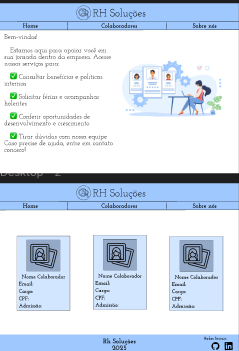

# PROJETO PORTFÓLIO

Este projeto consiste em um sistema simplificado de Recursos Humanos com foco principal no cadastro e gerenciamento de informações básicas dos funcionários. O sistema visa facilitar a organização e o acesso a dados essenciais, como dados pessoais, contato, cargo e data de contratação.

 
Prototipo
 

 
 
Link do projeto no Figma:
https://www.figma.com/design/qK1Cp2PqTj7eS66vEjGCbD/PI?node-id=1-97&m=dev&t=P3gkLSGlGQU9ofVY-1
 
 
